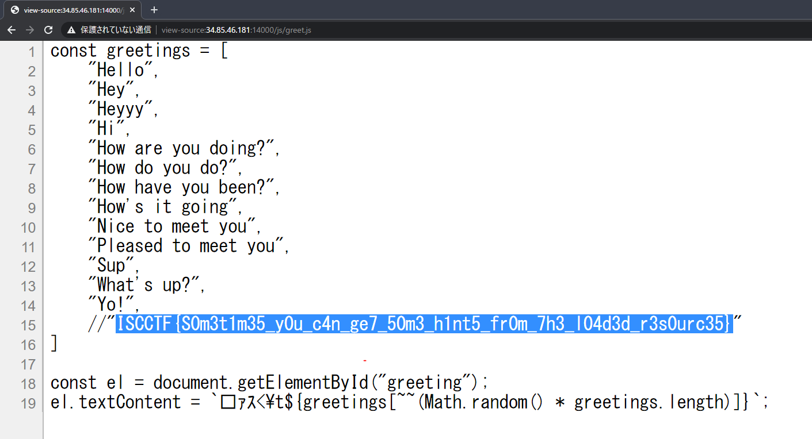

# [Web(easy)]Greetinjs

## 問題文

**(ja)**

🧽の挨拶には、いくつかバリエーションがあるみたいですね。

<http://203.0.113.1:14000/>

**(en)**

There seems to be some variations in  🧽's greetings.

<http://203.0.113.1:14000/>

---

作問者(Author): [8ayac](https://twitter.com/8ayac) / レビュワー(Reviewer): [Azara](https://twitter.com/a_zara_n)

## Writeup

問題ページにアクセスすると、スポンジ(🧽)が挨拶してくる。
何度かページをリロードさせると、挨拶には、いくつか種類があることがわかる。

挨拶をどのように変化させているのか、が気になる。
調べるためにブラウザの開発者ツールや、curlコマンドを利用して、ページのHTMLソースを見てみる。
すると、`<script src="/js/greet.js">`という記述を見つけられる。

```html
<html lang="en">

<head>
    <meta charset="UTF-8">
    <title>Greetinjs</title>
</head>

<body>
    <h1 id="greeting">🧽&lt;	How are you doing?</h1>
    <script src="/js/greet.js" integrity="sha256-YGYMAxXgNvSLDsI84uyLSK3A6nGvi72AgtRRCy/R/e4="></script>

</body>

</html>
```

ここで、読み込まれた`/js/greet.js`を使って、スポンジの挨拶は変化させられているそうだ、とわかる。
実際に、`/js/greet.js`の中身を見てみると、下記のようにFlagがコメントアウトされているのが、見つけられる。



### flag

`ISCCTF{S0m3t1m35_y0u_c4n_ge7_50m3_h1nt5_fr0m_7h3_l04d3d_r3s0urc35}`
